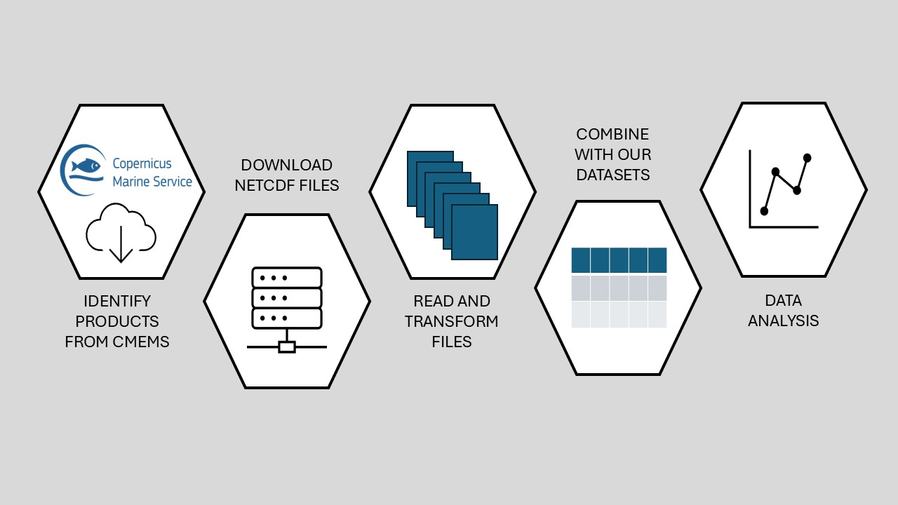

<!-- 
This file is part of a gitbook that should be cited as: 

XX

This tutorial has been supported by the XX project
-->

# Introduction

The Copernicus Marine Environment Monitoring Service (CMEMS) provides a wide range of data products for the global ocean. The data is available through the CMEMS website, but can also be accessed programmatically using the CMEMS API. 

The Copernicus Marine Toolbox is a free and easy-to-use tool that interoperates with the Copernicus Marine Data Store intending to cover any use case, from retrieval of metadata to a complete dataset, or just a subset, for any type of product: numerical models, satellite and/or in situ observations. It is written in Python, but 

<!-- https://help.marine.copernicus.eu/en/articles/4469993-how-to-download-copernicus-marine-products -->

<!-- https://help.marine.copernicus.eu/en/articles/8638253-how-to-download-data-via-the-copernicus-marine-toolbox-in-r -->


All the data available are in NetCDF format. We provide examples of how to read and work with these files and merge them with other data sources. 


```{r, eval=T, message=FALSE, warning=FALSE}
library(ggplot2)
```

```{r, echo=FALSE}

```
