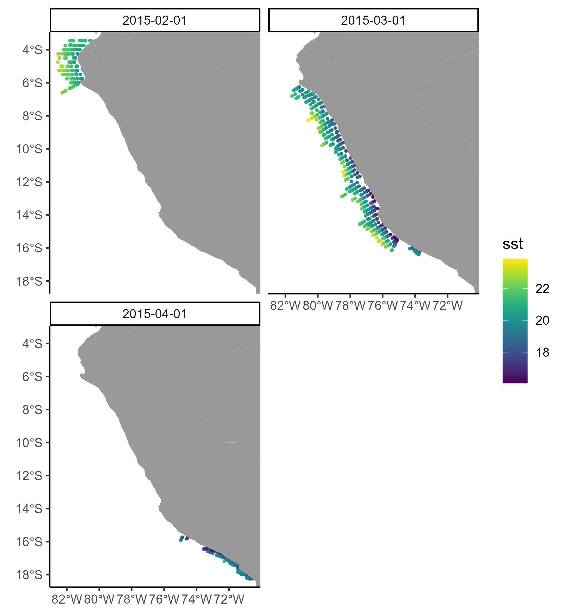

<!-- 
This file is part of a gitbook that should be cited as: 

XX

This tutorial has been supported by the XX project
-->

# Extract the information from the netCDF files

Once you have downloaded the oceanographic data, you will probably want to extract information for a set of observations. In this section, we present a simple way to do this extraction. 

## Read your observations

Let's assume you have your observations saved as a CSV file. We are going to use [this dataset](https://github.com/GiancarloMCorrea/extractOceanVariables/blob/main/data/example_data.csv) as example. The first step is to read the CSV file:

```{r, message=F, warning=F, eval=T}
require(readr)
my_data = read_delim("https://raw.githubusercontent.com/GiancarloMCorrea/extractOceanVariables/refs/heads/main/data/example_data.csv", delim=";")
head(my_data)
```

This dataset may have several columns, but it should have at least three columns with the following information: longitude (numeric), latitude (numeric), and date (character, `%Y-%m-%d`). There should not be missing information (i.e., `NA`) for these three columns.

## Extract oceanographic data

To extract the oceanographic data, we will use the `matchCOPERNICUS` function (you can find it [here](https://github.com/GiancarloMCorrea/extractOceanVariables/blob/main/code/copernicus/multiple/matchCOPERNICUS.R)). The instructions provided below work when downloading multiple `.nc` files as explained in Section \@ref(sec-2-data-multiple).

`matchCOPERNICUS` creates a new column in your observations dataframe (i.e., `my_data`) with the oceanographic variable that corresponds to the longitude/latitude/date combination of every row.

Before extracting the oceanographic variable, we will load the `matchCOPERNICUS`, required libraries, and some auxiliary functions directly from Github:

```{r, eval=F}
source("https://raw.githubusercontent.com/GiancarloMCorrea/extractOceanVariables/refs/heads/main/code/copernicus/multiple/matchCOPERNICUS.R")
source("https://raw.githubusercontent.com/GiancarloMCorrea/extractOceanVariables/refs/heads/main/code/auxFunctions.R")
require(dplyr)
require(lubridate)
require(stars)
```

Then, we extract the data:

```{r, eval=F}
my_data = matchCOPERNICUS(
            data         = my_data,
            lonlat_cols  = c("Lon_M", "Lat_M"),
            date_col     = "Date",
            var_label    = "sst",
            var_path     = "C:/Use/env_data/",
            depth_FUN    = "mean",
            depth_range  = c(0, 25)
            )
```

- `data` is the dataframe with the observations.
- `lonlat_cols` is a character vector with the column names of the longitude and latitude in `data`.
- `date_cols` is a character with the column name of the date in `data`.
- `var_label` is the name of the column that will be created with the oceanographic data. It does not need to be the same as the variable name you are extracting.
- `var_path` is the path where the `.nc` files are saved.

Since we are matching information using longitude/latitude/date, the depth dimension needs to be summarized somehow. `depth_FUN` is the function that will be applied to summarize all the information within the `depth_range` vector (in meters). 

For monthly oceanographic data, `matchCOPERNICUS` will extract the information for the corresponding month.

`matchCOPERNICUS` has also another argument called `nc_dimnames`:

```{r, eval=F}
matchCOPERNICUS(
    ...,
    nc_dimnames = c("x", "y", "time")
    )
```

Which is a character vector with the longitude, latitude, and date dimension names in the `.nc` files. By default, it is set to `c("x", "y", "time")`, but you can change it if needed.

## Plot the extracted oceanographic information

It is always important to plot the extracted environmental variable to check if the matching has been correctly done. First, let's create a new column containing the month for every row:

```{r, eval=F}
my_data = my_data %>% mutate(month = floor_date(as.Date(Date, format = "%Y-%m-%d"), "month"))
```

Then, we could make a simple plot using the `ggplot2` package:

```{r, eval=F}
require(sf)
require(viridis)
require(ggplot2)
# Find longitude and latitude ranges in our observations
xLim = range(my_data$Lon_M) + 0.5*c(-1, 1)
yLim = range(my_data$Lat_M) + 0.5*c(-1, 1)
# Transform our observations to sf point object:
MyPoints = my_data %>% st_as_sf(coords = c("Lon_M", "Lat_M"), crs = 4326, remove = FALSE)
# Get worldmap object:
worldmap = ggplot2::map_data("world")
colnames(worldmap) = c("X", "Y", "PID", "POS", "region", "subregion")
# Make plot:
ggplot() +
  geom_sf(data = MyPoints, aes(color = sst), size = 0.5) +
  scale_colour_viridis() +
  geom_polygon(data = worldmap, aes(X, Y, group=PID), fill = "gray60", color=NA) +
  coord_sf(expand = FALSE, xlim = xLim, ylim = yLim) +
  xlab(NULL) + ylab(NULL) +
  theme_classic() +
  facet_wrap(~ month)
```

```{r, echo=FALSE}

```

## Imputation of missing information

In some cases, there may be `NA` when extracting the oceanographic data. We could fill these `NA` using the mean value around the location with missing information. We have made an R function, called `fill_NAvals` to do so (you can find it [here](https://github.com/GiancarloMCorrea/extractOceanVariables/blob/main/code/auxFunctions.R) and was loaded above). 

```{r, eval=F}
my_data = fill_NAvals(
                data         = my_data,
                lonlat_cols  = c("Lon_M", "Lat_M"),
                var_col      = "sst",
                group_col    = "month",
                radius       = 10
              )
```

- `data` is the dataframe with the observations.
- `lonlat_cols` is a character vector with the column names of the longitude and latitude in `data`.
- `var_col` is a character with the column name of the oceanographic variable in `data`.
- `group_col` is the name of the column that will be used as grouping. For example, we might only want to average month-specific locations when filling `NA`.
- `radius` defines the radius (km) around the location with missing information to calculate the average. 
