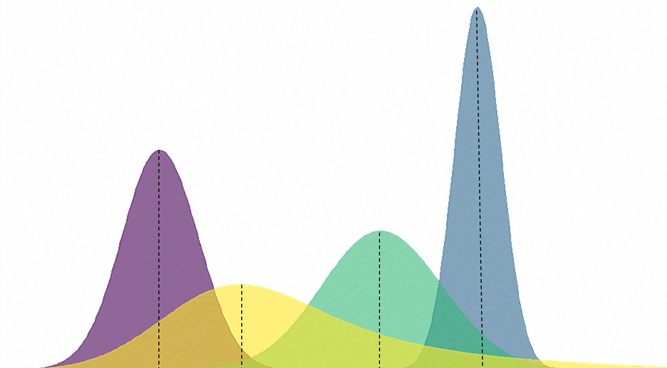

--- 
title: "Download and prepare data from the Copernicus Marine Environment Monitoring Service (CMEMS)"
author: "AZTI"
date: "`r Sys.Date()`"
site: bookdown::bookdown_site
documentclass: book
bibliography:
- references.bib
description: |
  This is a short tutorial explaining how to download and prepare data from the Copernicus Marine Environment Monitoring Service (CMEMS).
link-citations: yes
github-repo: Fundacion-AZTI/gam-niche
---


# About {-}

This is a short tutorial explaining how to download and prepare data from the Copernicus Marine Environment Monitoring Service (CMEMS).

The code is available in [AZTI's github repository](https://github.com/Fundacion-AZTI/gam-niche) and the book is readily available [here](https://fundacion-azti.github.io/gam-niche/).This work is licensed under a [Creative Commons Attribution-NonCommercial-ShareAlike 4.0 International License (CC BY-NC-SA 4.0)](https://creativecommons.org/licenses/by-nc-sa/4.0/)


<!--  -->

To cite this book, please use:

Valle, M., Citores, L., Ibaibarriaga, L., Chust, C. (2023) GAM-NICHE: Shape-Constrained GAMs to build Species Distribution Models under the ecological niche theory. AZTI. https://doi.org/10.57762/fzpy-6w51

<!-- the code below is to have an image over the book title -->
```{js, echo = FALSE}
title=document.getElementById('header');
title.innerHTML = '' + title.innerHTML
```

<!-- the code below is avoid too long lines in the outcome -->
```{r, echo=FALSE}
library(knitr)
# Set so that long lines in R will be wrapped:
opts_chunk$set(tidy.opts=list(width.cutoff=40), tidy=TRUE)
```
